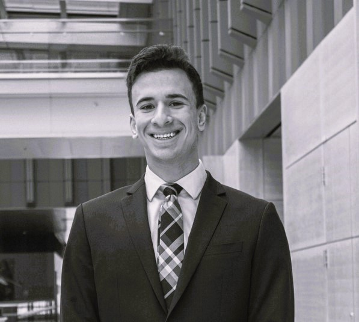

# About Us


## Ryan Berger

Hey! I'm Ryan Berger. I am a current Master's of Business Analytics student at Michigan Ross. In my undergrad, I also attended Michigan through the School of Information, studying data analytics. I am from New Jersey, which means I am a Giants fan and I like to say I'm from New York. Go Blue!

```{r echo=FALSE, out.width = '40%'}

```

## Adam Zhang

```{r echo=FALSE, out.width = '40%'}
knitr::include_graphics("AZ.jpg")
```

Hi! I'm Adam 

## Michelle Xu

Hello, I'm Michelle Xu, originally from China. I spent six years living in the beautiful city of San Diego, California. After high school, I moved to Ann Arbor, Michigan, to pursue a major in Bioinformatics at LS&A. Currently, I'm a Master of Business Analytics student at the University of Michigan, Ross School of Business. 

```{r echo=FALSE, out.width = "40%"}
  knitr::include_graphics("WechatIMG10.jpeg")
```

## Sona Coshal

Hi, my name is Sona! I'm born and raised in Columbia, South Carolina and a proud USC Gamecock! I have a BSBA in Finance and Supply Chain from the Darla Moore School Business.

```{r echo=FALSE, out.width = "40%"}
  knitr::include_graphics("Sona's_Photo.jpg")
```

## Fuad Chedid

Hi! I'm Fuad, a native Michigander! Before joining the Master of Business Analytics program at Michigan Ross, I was based in Dubai, UAE. I consider myself a "tech head" and my main area of interest is the intersection of business and technology. I enjoy travelling and so far have visited 27 countries and five continents. 

```{r echo=FALSE, out.width="40%"}
knitr::include_graphics("fpic.jpeg")
```

