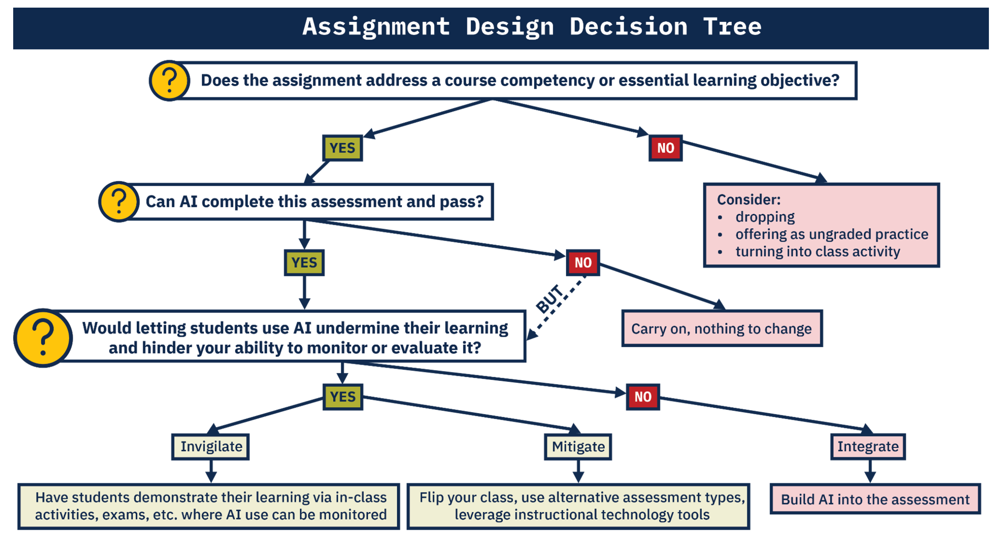

# Current State of Affairs

Since the proliferation of publicly available generative AI in November 2022, U-M has been positioning itself to respond and adapt. Undoubtedly, there is a need for institutional understanding and action to ensure that generative AI is leveraged in support of the University's mission. This section provides information on the currently published university-wide guidance.

## U-M GenAI Website

Recently established by the GAIA Committee (see \@ref(gaia-committee)), <https://genAI.umich.edu> is a comprehensive resource containing the latest guidance and information for all members of the U-M community.

## GAIA Committee

The Generative AI Advisory ([GAIA](https://it.umich.edu/strategy-planning/gaia)) Committee was established in the first half of 2023, with the overall aim being:

> "to provide guidance to the university community for the use of generative AI and provide strategic advice to the VPIT-CIO and Provost."

An overview of the committee's [official report](https://genai.umich.edu/committee-report), published on June 30th 2023, is provided in section \@ref(initial-report-june-30-2023).

The committee currently includes members from the following schools, colleges, and departments:

| School / College / Department                    | \# of Member(s) |
|--------------------------------------------------|-----------------|
| **Executive Sponsor**                            | 1               |
| **College of Engineering**                       | 4               |
| **Medical School**                               | 2               |
| **School of Public Health**                      | 1               |
| **College of Literature, Science, and the Arts** | 3               |
| **School of Education**                          | 2               |
| **School of Information**                        | 2               |
| **Ross School of Business**                      | 2               |
| **Information and Technology Services**          | 1               |
| **Center for Research on Learning and Teaching** | 1               |
| **Center for Academic Innovation**               | 1               |
| **Office of the Provost for DE&I**               | 1               |
| **U-M Flint**                                    | 1               |
| **U-M Dearborn**                                 | 1               |

*As of Aug 2023. Note: Some members represent more than one affiliation.*

### Initial Report (June 30 2023)

The below extracts from the report have been selectively chosen based on their immediate relevancy to instructors.

#### Overall Recommendations {.unnumbered}

A brief highlight of the overarching recommendations:

{width="30" height="20"}

> -   Dissemination of guidance and launch of campus discussion (Timeline: immediate).
>
> -   Teaching, Learning, and Academic Innovation (Timeline: Fall 2023). U-M can approach GenAI as an opportunity to rethink how we teach and define meaningful learning objectives, promote inclusion and equity, and assess learning. **Instructors should be given complete flexibility to allow or disallow the use of GenAI tools.**
>
> -   Assess the use of GenAI in research and set best practice standards for privacy protections; data use controls; and updating research integrity reated SPGs, PEERS modules, and RCR training.
>
> -   Provost, VPR and VPIT should establish a U-M wide research initiative in the area of Generative AI (Timeline: Fall 2023/Winter 2024).
>
>     -   U-M should consider developing its own version of foundation GenAI models to enable research and innovation (Timeline: Begin activities in Fall 2023).
>
> -   Expansion of IT infrastructure to accommodate secure and equitable access to GenAI plat- forms and tools (Timeline: Immediate and Variable).
>
>     -   Create and deliver new GenAI services. These services will be offered across three tiers, each catering to different needs and technical proficiencies and made available to Ann Arbor, Flint, and Dearborn.
>
> -   VPIT to work with the GAIA committee to coordinate and establish an AI digital commons where our community can share best practices and emerging ideas in GenAI (Timeline: Immediate).
>
> -   Launch a U-M GenAI website providing strategy, policies, resources, and links. Coordinate this with a well-defined communication plan (Timeline: Immediate).

{width="30" height="20"}

#### Key Benefits and Opportunities {.unnumbered}

Highlights of key benefits and opportunities:

{width="30" height="20"}

> -   GenAI will enable U-M to advance its mission and accelerate and support Vision 2034.
>
> -   GenAI has the potential to transform teaching outcomes by creating customizable learning pathways
>
> -   GenAI will accelerate knowledge development,including rethinking of disciplinary boundaries and domains, and possibly, defining new ones.
>
> -   From an efficiency perspective, GenAI has the potential to support enhanced administrative productivity and service quality throughout the University.
>
> -   **U-M has the intellectual depth, resources, and international and national connections and networks to be the leader in the development and appropriate use of GenAI.**

{width="30" height="20"}

#### Key Threats and Weaknesses {.unnumbered}

Highlights of key threats and weaknesses:

{width="30" height="20"}

> -   Several technical weaknesses currently exist, including temporal ignorance, hallucination and fabrication, misattribution, overriding safety protocols, inadvertent inclusion breaches or ethical problems, and bias in training data.
>
> -   Social weaknesses refer to those that arise from the interaction between the system and user, which may yield unanticipated actions and outcomes. While myriad and evolving, a few examples of social weaknesses include
>
>     -   rapid escalation of deep fakes in video and audio,
>
>     -   user attribution of output generated by GenAI to themselves or others,
>
>     -   GenAI companion giving dangerous advice to children,
>
>     -   use of GenAI to perform research without appropriate disclosure,
>
>     -   inappropriate use of prompt data by AI provider,
>
>     -   reduced demand for human labor in many professions,
>
>     -   inequitable access to state-of-the-art GenAI systems,
>
>     -   and unauthorized generation or replication of copyrighted or otherwise protected material.

{width="30" height="20"}

#### Instructor Recommendations {.unnumbered}

The committee's initial report identifies teaching and learning as the most *"immediate and significant GenAI application domain"* and provides guidance to instructors to help prepare for the Fall 2023 semester. The below sections include highlights of the guidance.

Generally, the committee finds that it is presently "nearly impossible to enforce" banning GenAI use in coursework. And therefore, strongly recommends that instructors consider the following questions when adapting course work:

{width="30" height="20"}

> -   Should GenAI be used in the course or not---and why or why not?
>
> -   If GenAI is to be used, how is the use to be documented?
>
> -   Should course learning objectives be revised?
>
> -   Should GenAI competencies be taught in the specific disciplinary context?
>
> -   Should assessments be revised?

{width="30" height="20"}

##### GenAI: permit or ban? {.unnumbered}

The report also addresses the fact that current academic misconduct definitions, Honor Codes, and academic integrity policies do not account for GenAI explicitly, and should be updated. The committee also acknowledges that students who use GenAI in an unauthorized manor may be committing cheating or plagiarism.

In determining GenAI permissability within academic misconduct policies, the report provides the following view:

{width="30" height="20"}

> Common approaches to updating academic misconduct policies are:
>
> -   Determining that ChatGPT (or GenAI) is prohibited help from another "person" (e.g., UCLA),
>
> -   Defining GenAI as a "source" that should be acknowledged (e.g., UW Madison).
>
> The GAIA committee believes that the "person" approach misleadingly attributes sentience and a reasoning capacity to GenAI, and proposes that the "source" approach is more workable, and aligned with our mission of teaching students to engage effectively and ethically with the world around them.

{width="30" height="20"}

With regard to course policy, the report provides the following guidance to instructors:

{width="30" height="20"}

> -   it is critical that expectations are clearly articulated in the syllabus and continually reinforced when assignments are given.
>
> -   **instructors should be given flexibility to allow or disallow the use of GenAI tools. If the latter approach is adopted, the committee discourages the use of surveillance and plagiarism detection tools as they cannot be reliably counted upon at the present moment.**
>
> -   GenAI is changing rapidly, and new tools will become available. Course policies therefore need to be provisional and subject to change.
>
> Course policies might fall into one of three categories:
>
> -   Specific uses of GenAI are encouraged (generating ideas, editing, translating, outlining).
>
> -   Specific uses of GenAI are allowed if students clearly distinguish between their original work and GenAI output (highlighting output, tracking changes in GenAI output).
>
> -   Any use of GenAI constitutes academic misconduct.
>
> If GenAI tools are allowed, the instructor should be clear which tools are allowed and in what capacity. On the other hand, if GenAI tools are disallowed, the committee suggests that the instructor give reasons why the use of GenAI tools would hinder learning.

{width="30" height="20"}

The report also suggests instructors review recommendations from <http://sentientsyllabus.org> for items to consider including in the syllabus.

##### Redesigning Coursework {.unnumbered}

The committee recommends that, out the outset, instructors become familiar with and practice using GenAI tools. For information regarding currently available tools, see section \@ref(publicly-available-generative-ai).

Once familiarized, the committee recommends that instructors consider the following with respect to their current course design:

{width="30" height="20"}

> 1.  What are the course objectives and rationale for them? Can GenAI be used to meet any of the objectives?
>
> 2.  Are there new learning objectives in the areas of knowledge, skills, or values about GenAI that students need to meet? Will students have equitable access to GenAI for these objectives?
>
> 3.  What tasks do students need to complete to demonstrate they meet the learning objectives?
>
> 4.  How will learning be assessed?
>
> 5.  Do the objectives, tasks, or assessments present problems with respect to equity, inclusion, diversity, or accessibility? If so, can they be adjusted to ensure fairness and inclusion?

{width="30" height="20"}

The committee recommends "**that the course design should include some parts that cannot be completed satisfactorily (solely) by GenAI tools,** unless GenAI skills and values are the primary learning objectives." Moreover, **"Instructors are encouraged to try completing assignments using GenAI tools before distribut- ing assignments to students."** The following guidance for how to adjust course design (summarized) is provided:

{width="30" height="20"}

> -   Larger component of technology-free in-class assignments
>
> -   Focus on higher-order thinking
>
> -   Prioritize authentic instruction and assessment
>
> -   Require accurate and verifiable citation of sources
>
> -   Teach academic integrity
>
>     -   What do students need to learn and why
>
>     -   What skills will students gain from using AI, what knowledge will they need to apply?

{width="30" height="20"}

```{r echo=FALSE, out.width = "100%", fig.align="center", fig.cap="Decision tree help facilitate 'transparent assignment design' provided in the June 2023 GAIA report."}
if (knitr:::is_latex_output()) {
  knitr::asis_output('\\url{....}')
} else {
  
}
```

##### Considerations for Writing-intensive Courses {.unnumbered}

For writing-intensive courses, the committee recognizes there are specific challenges to be addressed. Below is a summary of the guidance provided:

{width="30" height="20"}

> -   GenAI will transform traditional academic writing, multimodal/multimedia composition, and creative expression in every U-M school and college.
>
> -   It is imperative that instructors continue to teach writing as well as multimedia/multimodal composition.
>
> -   GenAI presents opportunities and potential benefits. It can be used at any point in the writing process to complement and expand students' thinking, project planning, brainstorming, research, outlining, drafting, and revision processes. There are risks involved in using GenAI in these ways: use of GenAI may impair original thinking and problemsolving; students' privacy is not protected; the output may contain fabrications, falsifications, biases, or errors. Students are nonetheless responsible for the work they turn in, including the truthfulness, academic integrity, and biases of content.
>
> -   GenAI tools can be used as a cheating machine, so threats to academic integrity should be anticipated and mitigated in U-M's academic misconduct policies and in syllabus statements.
>
> -   Instead of eliminating writing assignments, instructors should consider how they might adapt their goals for writing assignments to new GenAI environments.

{width="30" height="20"}

## U-M GPT and other U-M Tools

U-M intends to launch custom GenAI services. And beginning in Fall 2023, the three below services will be available. More information on these services can be found at <https://genai.umich.edu>.

### U-M GPT

The university provides the following description:

{width="30" height="20"}

> Our most accessible offering is U-M GPT, a tool that provides access to popular hosted AI models such as GPT 3.5, GPT 4.0, and Llama 2.
>
> -   Initially provided at no cost to the entire U-M community to celebrate the launch of our AI Services
>
> -   User-friendly interface (Fully accessible and equitably available for all U-M instructors, students, and staff)
>
> -   Interactions with U-M GPT will remain confidential to the institution
>
> -   Appropriate for use with moderate sensitive data

{width="30" height="20"}

U-M GPT (currently in beta) can be accessed at <https://umgpt.umich.edu>

```{r echo=FALSE, out.width = "75%", fig.align="center", fig.cap="Example of a question one could ask U-M GPT"}
if (knitr:::is_latex_output()) {
  knitr::asis_output('\\url{....}')
} else {
  knitr::include_graphics("umgpt.gif")
}
```

### U-M Maizey

{width="30" height="20"}

> The U-M Maizey offering is a text-based interface that enables faculty, staff, and students to query and question datasets, leveraging the power of AI to enhance their understanding of the data. This service empowers users to extract valuable insights, discover patterns, and gain deeper knowledge from the available datasets.
>
> -   Dedicated support from ITS and vendors
>
> -   Appropriate for use with some sensitive data
>
> -   Accessible to all U-M students, faculty, and staff with a valid Shortcode from their school or unit
>
> -   No cost access until September 30 with usage limits based on capacity

{width="30" height="20"}

### U-M GPT Toolkit

{width="30" height="20"}

> U-M GPT Toolkit is our most advanced and flexible offering. It is designed for those who require full control over their AI environments and models, including those working with sensitive data.
>
> -   Requires deep technical knowledge to access and execute
>
> -   Full control over AI environments and models
>
> -   Suitable for handling sensitive data
>
> -   Hosting support from ITS through federated environments
>
> -   Share models to U-M GPT through ITS partnership

{width="30" height="20"}

## Other U-M Guidance

Other University of Michigan guidance on GenAI:

-   [Artificial Intelligence and U-M Institutional Data - IT Guidance](https://safecomputing.umich.edu/protect-the-u/safely-use-sensitive-data/AI-and-UM-Data)

    -   Highlights:

        > *"Accordingly, as with any other IT service or product with no university contract or agreement, AI tools should only be used with institutional data classified as LOW. [See U-M Data Classification Levels for descriptions and examples of each data classification](https://safecomputing.umich.edu/protect-the-u/safely-use-sensitive-data/classification-levels).*
        >
        > *Do not use ChatGPT or other AI with information such as student information regulated by FERPA, human subject research information, health information, HR records, etc."*

-   [GenAI section in U-M 'Introduction to Academic Integrity'](https://guides.lib.umich.edu/c.php?g=1039501&p=9763907)
