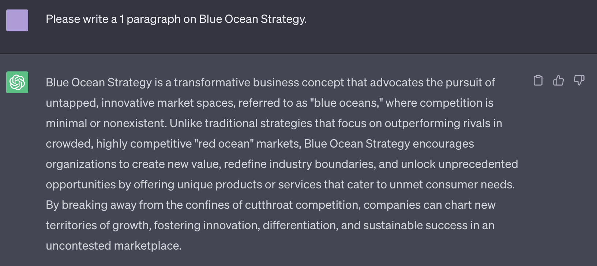

# Publicly Available Generative AI

Publicly available generative AI refers to a set of artificial technologies that are accessible to the general public and are designed to create new content based on existing data. These AI models utilize advanced machine learning techniques to generate original outputs that exhibit characteristics similar to the training data they've been exposed to. Some wel-known examples of such AI tools include ChatGPT, Bing AI, Explainpaper, GitHub Copilot, etc. While these tools are gaining increasing popularity, it is important to note that they are not officially endorsed by the school. 

>"The University of Michigan does not endorse any specific AI tools." -- University of Michigan

## ChatGPT (Chat Generative Pre-trained )

Developed by OpenAI, ChatGPT is an advanced chatbot powered by the GPT-3.5 architecture, short for 'Generative Pre-trained Transfomer 3.5'. The model is trained on a vast amount of text data from various sources like books, articles, and websites, which helps it understand language patters and aquire a wide knolwedge base. It employs Natural Language Processing (NLP) to respond to queries, generate content, condense data and perform many other tasks. 

```{r echo=FALSE, out.width = "90%"}
  
```

## Bing Chat

Microsoft's Bing AI Chat is a chatbot powered by the GPT-4 model from OpenAI. It redefines the Bing search engine experience by offering more than conventional search results. Seamlessly integrated with Bing's serach capabilities, the chatbot utilizes its machine learning techniques to process extensive data and deliver responses in a conversational manner. 

## Google Bard


## Explainpaper 

## Goblin Tools 

## Codeium 

## DALL-E 2 

DALLE is an advanced AI system developed by OpenAI that specializes in creating realistic images and art based on natural language descriptions. Users can provide text description of scenes, concepts or attributes and DALLE can translate these descriptions into images. 


## AIVI

## GitHub Copilot

## Stable Diffusion