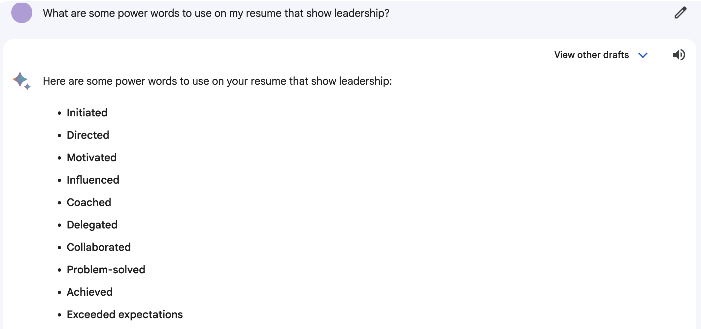
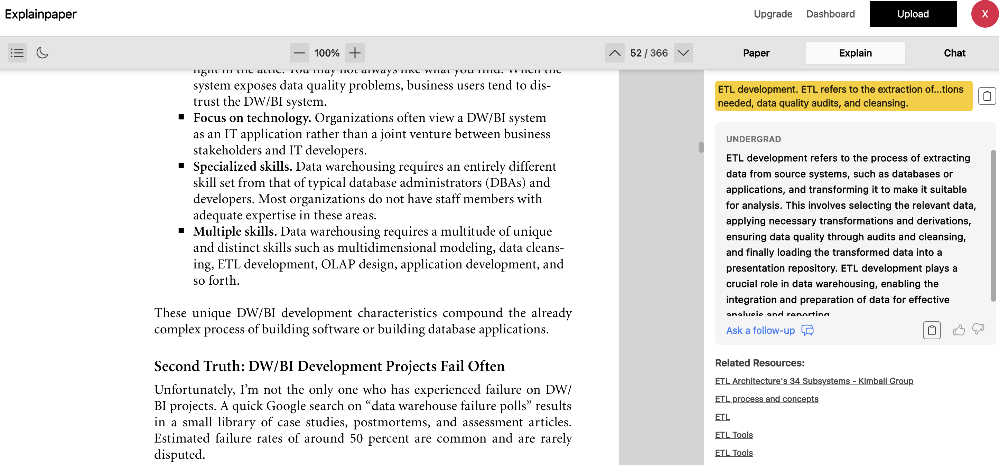
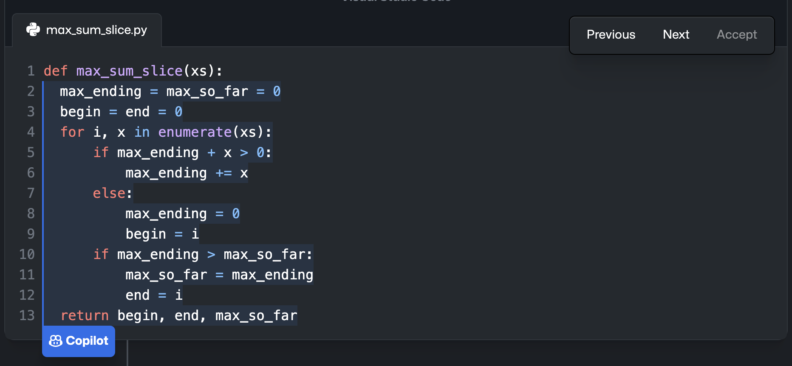
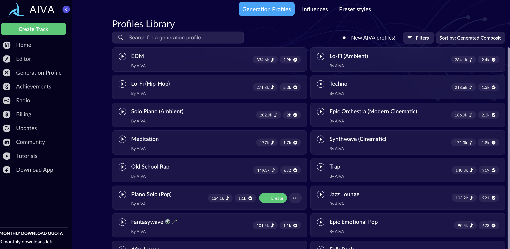

# Publicly Available Generative AI

Publicly available generative AI refers to a set of artificial technologies that are accessible to the general public and are designed to create new content based on existing data. These AI models utilize advanced machine learning techniques to generate original outputs that exhibit characteristics similar to the training data they've been exposed to. Some well-known examples of such AI tools include ChatGPT, Bing AI, Explainpaper, GitHub Copilot, etc. While these tools are gaining increasing popularity, it is important to note that they are not officially endorsed by the school. 

>"The University of Michigan does not endorse any specific AI tools." -- University of Michigan

## ChatGPT (Chat Generative Pre-trained )

Developed by OpenAI, ChatGPT is an advanced chatbot powered by the GPT-3.5 architecture, short for 'Generative Pre-trained Transformer 3.5'. The model is trained on a vast amount of text data from various sources like books, articles, and websites, which helps it understand language patters and acquire a wide knowledge base. It employs Natural Language Processing (NLP) to respond to queries, generate content, condense data and perform many other tasks. 

```{r echo=FALSE, out.width = "90%", fig.align="center", fig.cap="Example of a question one could ask ChatGPT"}
  knitr::include_graphics("ChatGPT_Example.jpeg")
```

## Bing Chat

Microsoft's Bing AI Chat is a chatbot powered by the GPT-4 model from OpenAI. It redefines the Bing search engine experience by offering more than conventional search results. Seamlessly integrated with Bing's serach capabilities, the chatbot utilizes its machine learning techniques to process extensive data and deliver responses in a conversational manner. 

```{r echo=FALSE, out.width = "40%", fig.align="center", fig.cap="Example of a question one could ask Bing Chat"}
if (knitr:::is_latex_output()) {
  knitr::asis_output('\\url{....}')
} else {
  knitr::include_graphics("Bing_Chat_Example.gif")
}
```

## Google Bard

Google Bard is an innovative AI chatbot designed to increase productivity and transform ideas into reality. With its blend of machine learning and natural language processing, Bard stands as an experiment that aim to amplify people's imagination and enhance collaboration. However, as an experiment, it might occasionally provide inaccurate and inappropriate responses, which makes user feedback essential for its refinement.

```{r echo=FALSE, out.width = "90%", fig.align="center", fig.cap="Example of a question one could ask Google Bard"}
  
```

## Explainpaper 

Explainpaper is a platform designed to simplify comprehension and learning of academic papers. It allows users to upload a paper, identify confusing sections of the text through highlighting and subsequently receive corresponding explanations. Complementing the explanations, additional resources related to the section are also shown to the users. 

```{r echo=FALSE, out.width = "90%", fig.align="center", fig.cap="Example of what Explainpaper can be used for"}
  
```
## GitHub Copilot

GitHub Copilot is an AI developer tool that has gained significant recognition and was widely adopted within the programming community. Developed through a collaborative effort involving GitHub, OpenAI, and Microsoft, GitHub Copilot is a powerful tool that utilizes a generative AI model trained on extensive lines of code. Its primary function is to offer coding suggestions in multiple programming languages by interpreting natural language prompts. 

```{r echo=FALSE, out.width = "95%", fig.align="center", fig.cap="Example usage of GitHub Copilot"}
  
```

## Goblin Tools 

Goblin Tool offer a comprehensive solution for developers seeking guidance on difficult programming tasks. This tool utilizes its expertise to break down complex processes into manageable stages, which ensures that developers can follow a clear and structured path to successful implementation. 

```{r echo=FALSE, out.width = "70%", fig.align="center", fig.cap="Example of a programming task fed to Goblin Tool"}
  
```

## DALL-E 2 

DALLE is an advanced AI system developed by OpenAI that specializes in creating realistic images and art based on natural language descriptions. Users can provide text description of scenes, concepts or attributes and DALLE can translate these descriptions into images.

```{r echo=FALSE, out.width = "70%", fig.align="center", fig.cap="\"Girl with a pearl earring and a snake\" by Johannes Vermeer"}
  
```

## Gen-1 Runway ML 

Runway ML allows users to transform text into video, create images from prompts, expand and re-image images, train custom AI models, manipulate videos, apply slow-motion effects, and so on. 

```{r echo=FALSE, out.width = "70%", fig.align="center", fig.cap="Example usage of Runway ML: Image -> Video"}
if (knitr:::is_latex_output()) {
  knitr::asis_output('\\url{....}')
} else {
  knitr::include_graphics("Runway_Example.GIF")
}
```

## AIVI

AIVA is an AI tool designed to assist individuals in composing emotional and engaging soundtracks. It offers a range of predefined music styles like Modern, Pop, Rock, Jazz, etc. and to compose music. The platform offers a user-friendly interface that allows users to input specific parameters and preferences like style, mood and instrumentation and then generate original music that aligns with those criteria. 

```{r echo=FALSE, out.width = "95%", fig.align="center", fig.cap="AIVI Dashboard"}
  
```